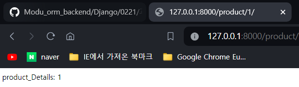
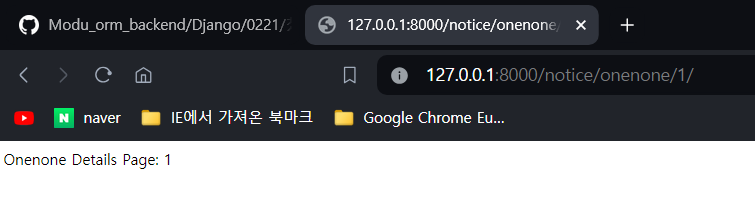

# django
```python
# 폴더 기준으로 VSC 열기
#     * 이 작업은 리눅스 명령어 나중에 배울때 까지 똑같은 방식으로 진행하겠습니다.(내가 리눅스 명령어를 좀 안다! 하시는 분은 동일하게 안하셔도 됩니다.)
#     * File > Open Folder 누르시고 Django 작업할 폴더를 열어주세요.

# 터미널을 열어 작업
#     * 터미널(Ctrl + `), 단축키 대신 VSC에서 Terminal > new Terminal
# 이 명령어는 powershell 에서 치고 있습니다.
# 터미널 오른쪽 상단 +버튼 옆 아래 꺾쇠 버튼 눌러스 powershell을 열어주세요.

python --version
# 파이썬 버전 확인
mkdir mysite
# mysite라는 폴더 생성 => 마우스 클릭하셔서 생성하는 것과 차이 없습니다. 보통 mysite라는 이름 대신 프로젝트 이름을 넣습니다.
cd mysite
# 폴더 이동
python -m venv venv
# 가상 환경 설정(이어 설명합니다.) 하는 명령어 입니다.

# 가상환경 설정
#     * 가상환경은 선택이 아니라 필수 입니다.
#     * 가상환경을 왜 잡을까요? 관리, 이관, 업데이트 등에 중요한 거점이 됩니다.
#     * pip list를 쳐보세요. 많은 python 라이브러리가 보이죠? 여기서 소숫점 3번째 짜리까지 안맞으면 작동 안되는 경우도 허다합니다. => 가상 환경은 통째로 다 이동합니다.
#     * `python -m venv venv`뒤가 가상환경 이름입니다.

# 가상환경속으로 들어가기
.\venv\Scripts\activate # window
.\venv\Script\activate.bat # window
source ./venv/bin/activate # mac, linux

# window에서 오류가 뜰 경우
+ CategoryInfo          : 보안 오류: (:) [], PSSecurityException
+ FullyQualifiedErrorId : UnauthorizedAccess
# 아래 명령어를 입력해주세요. 
# 혹시 이 명령어가 제대로 작동하지 않으면 관리자 권한으로 powershell을 여시고 아래 명령어를 입력해주세요. (혹시 입력해야 하는 창이 있으면 '모두 예'인 'A'를 입력해주세요.)
# VSC를 관리자권한으로 여셔서 작업하셔도 동일한 효과가 납니다.
Set-ExecutionPolicy Unrestricted

# 앞에 (venv) ~~~ 이런 상태에서만 작업을 하셔야 합니다. 이 곳이 가상환경입니다. 쉽게 말해 컴퓨터 안에 컴퓨터입니다!
# pip list 쳐보면 설치된 것이 없는 깨끗한 백지상태입니다.

pip install django
# django를 최신 버전으로 설치합니다. 구버전 설치 하고 싶으시면 pip install django==4.0

django-admin startproject tutorialdjango .
# 띄고 점 꼭 하셔야 합니다!!!! 설치된 django로 초기세팅 하겠다라는 명령어 입니다. 암기하는 명령어 입니다. tutorialdjango는 이름입니다. 여러분 마음대로 지셔도 되는 이름입니다.

python manage.py migrate
# 이 명령어는 우리가 짠 python 코드를 DB에 반영하는 코드입니다. 다만! 실무에서는 이 migrate라는 명령어를 초기 세팅이 다~~~ 끝나고 합니다. 특히 User나 Admin 가입 소스코드를 만지면 먼저 migrate를 하면 error가 나는 경우가 있습니다. 처음에 migrate를 하면 기본적으로 django에서 세팅해주는 소스코드를 DB에 생성, 반영합니다.

python manage.py runserver
# 파이썬 서버를 구동합니다. 이 명령어가 실행되는 동안에만 서버가 실행됩니다. Ctrl 누르고 서버 URL을 클릭해보세요.


################################
# tutorialdjango > settings.py

ALLOWED_HOSTS = ["*"] # 우리 웹 서비스에 접속할 수 있는 사람을 모든사람으로 설정

################################

# URL에 따라 보통 1개의 앱을 만듭니다. 이름만 앱입니다. 실제로 다른 애플리케이션이라는 얘기가 아닙니다. 이유는 권한, 그 안에 들어가는 로직 등을 별도로 관리하기 위해서 입니다. 예를 들어 회원 게시판이 있고 자유 게시판이 있다면 회원 게시판에는 회원만 글을 써야 합니다. 이런 식으로 URL에 따른 권한과 로직을 별도로 관리하기 위해서 앱을 만들어 관리합니다. 

# https://www.studyin.co.kr/ => A
# https://www.studyin.co.kr/offline/ => B
# https://www.studyin.co.kr/offline/1 => B
# https://www.studyin.co.kr/offline/100 => B
# https://www.studyin.co.kr/online => C

쇼핑몰을 만들 예정입니다. 쇼핑몰에 만들 url 목록은 아래와 같습니다. 
적절한 앱으로 나눠 설계하고 Django로 코딩해주세요.

1. 설계한 파일은 코드블록으로 올려주세요.
2. 접속이 제대로 되는지 product/1, notice/free/1, notice/onenone/1 3개를 캡쳐(이미지)해 올려주세요.

'www.hojunshopping.com' => main (index, about,contact)
'www.hojunshopping.com/product' => product (productlist, product1)
'www.hojunshopping.com/notice' => notice (noticelist, noticefree, onenone, onenone1)
+
'www.hojunshopping.com/qna' => qna, qna1
------------------------------------------------------------------
'www.hojunshopping.com' => 잘 나가는 상품 10개 소개
'www.hojunshopping.com/about' => 회사 소개
'www.hojunshopping.com/product' => 상품 목록
'www.hojunshopping.com/product/1'=> 상품 목록 상세 게시물
'www.hojunshopping.com/contact' => 오시는 길
'www.hojunshopping.com/qna' => Q&A 목록
'www.hojunshopping.com/qna/1'=> Q&A 상세 게시물
'www.hojunshopping.com/notice' => 자유게시판, 1:1게시판 선택 페이지
'www.hojunshopping.com/notice/free' => 자유게시판 목록
'www.hojunshopping.com/notice/free/1' => 자유게시판 상세 게시물
'www.hojunshopping.com/notice/onenone' => 1:1 상담 안내
'www.hojunshopping.com/notice/onenone/1'  => 1:1 상담 상세 게시물

앱이름: main      
URL주소     views 함수이름      html 파일이름       비고
''          index               index.html
'about/'    about               about.html
'contact/'  contact             contact.html      

앱이름: product        
URL주소     views 함수이름      html 파일이름       비고
''          product            product_list.html
'product1/' product_details    product1.html       

앱이름: notice      
URL주소     views 함수이름      html 파일이름       비고
''          noticelist         notice_list.html
'free/'     notice_details     free1.html
'onenone/'  notice_onenone     onenone1.html

앱이름: qna      
URL주소     views 함수이름      html 파일이름       비고
''          qna_list           qnalist.html
'qna1/'     qna_details        qna1.html


------------------------------------------------------

# Application definition

# tutorialdjango > settings.py 접속권한 모두로 변경
ALLOWED_HOSTS = ['*']
# tutorialdjango > settings.py app추가
# Application definition

INSTALLED_APPS = [
    'django.contrib.admin',
    'django.contrib.auth',
    'django.contrib.contenttypes',
    'django.contrib.sessions',
    'django.contrib.messages',
    'django.contrib.staticfiles',
    'main',
    'product',
    'notice',
    'qna',
]

# main app > urls.py 작성
from django.urls import path
from .views import index, about, contact

urlpatterns = [
    path("", index),
    path("about/", about),
    path("contact/", contact),
]

# main app > views.py 작성
from django.shortcuts import render 
from django.http import HttpResponse

def index(request): 
    return HttpResponse("index")

def about(request): 
    return HttpResponse("about")

def contact(request): 
    return HttpResponse("contact")

# notice app > urls.py 작성
from django.urls import path 
from .views import notice_list, notice_details, notice_free_list, notice_free_details, notice_onenone_list, notice_onenone_details

urlpatterns = [
    path("", notice_list), 
    path("<int:pk>/", notice_details),
    path("free/", notice_free_list),
    path("free/<int:pk>/", notice_free_details),
    path("onenone/", notice_onenone_list),
    path("onenone/<int:pk>/", notice_onenone_details),
]

# notice app > views.py 작성
from django.shortcuts import render
from django.http import HttpResponse

def notice_list(request):
    return HttpResponse("notice list")

def notice_details(request, pk):
    return HttpResponse(f"notice details: {pk}")

def notice_free_list(request):
    return HttpResponse("notice free입니다")

def notice_free_details(request, pk):
    return HttpResponse(f"Free Details Page: {pk}")

def notice_onenone_list(request):
    return HttpResponse("notice onenone입니다")

def notice_onenone_details(request, pk):
    return HttpResponse(f"Onenone Details Page: {pk}")


# product app > urls.py 작성
from django.urls import path 
from .views import product_list, product_details

urlpatterns = [
    path("", product_list),
    path("<int:pk>/", product_details), ]

# product app > views.py 작성
from django.shortcuts import render 
from django.http import HttpResponse

def qna_list(request): 
    return HttpResponse("qna_list")

def qna_details(request, pk): 
    return HttpResponse(f"qna_details {pk}")


# qna app > urls.py 작성
from django.urls import path 
from .views import qna_list, qna_details

urlpatterns = [ 
    path("", qna_list), 
    path("<int:pk>/", qna_details), 
    ]

# qna app > views.py 작성
from django.shortcuts import render 
from django.http import HttpResponse

def qna_list(request): 
    return HttpResponse("qna_list")

def qna_details(request, pk): 
    return HttpResponse(f"qna_details {pk}")

# product/1

# notice/free/1

# notice/onenone/1


